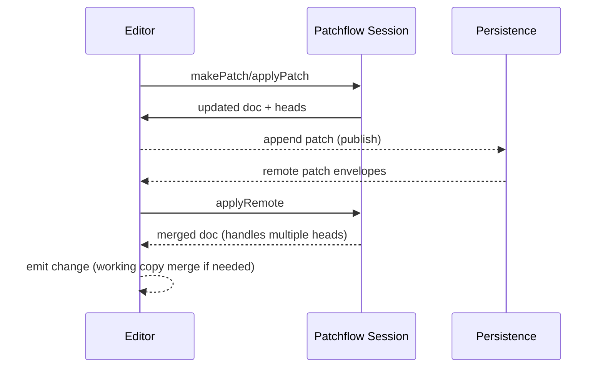

# Patchflow

Patchflow is a lightweight patch-DAG sync core factored out of the production [CoCalc](https://cocalc.com) sync engine. It keeps a compact history of patches with ancestry, merges heads deterministically, and leaves transports/storage to adapters. The design favors correctness and small revision logs over heavyweight CRDT metadata.

- https://www.npmjs.com/package/patchflow
- https://github.com/sagemathinc/patchflow

## Architecture

Edits flow from editors through Patchflow, out to persistence, and back as remote patches:



Patchflow does not directly handle editors, persistence or communication.

## Highlights

- Patch DAG: [src/patch-graph.ts](./src/patch-graph.ts) tracks ancestry, heads, newest common ancestors, and deterministic merges.
- Session orchestration: [src/session.ts](./src/session.ts) wraps a PatchGraph plus codecs/adapters; exposes commit, applyRemote, undo/redo pointers, history summaries, working copies, snapshots, and cursors.
- Document types:
  - Strings: [src/string-document.ts](./src/string-document.ts) with diff-match-patch.
  - SyncDB/JSONL tables: [src/db-document-immutable.ts](./src/db-document-immutable.ts) (immutable.js) and [src/db-document-immer.ts](./src/db-document-immer.ts) (immer) with indexed queries and string columns that use diff-match-patch for compact history.
- Adapters: in-memory patch store, file store, presence adapter; easy to plug your own transport.
- Examples: interactive TCP/file demo in [examples/tcp-session.ts](./examples/tcp-session.ts) and a syncdb demo in [examples/db-immer-session.ts](./examples/db-immer-session.ts).
- Tests: Jest coverage for patch graph, session, string docs, db docs (both backends), file queueing, presence, cursors, and working copies.
- Deterministic PatchIds: each patch has an opaque id `time` of the form `<time36>_<client>`, where `time36` is a monotone millisecond timestamp (base36, fixed width) and `client` is a per-session random id (base64url). This avoids logical-time collisions even when the same `userId` commits concurrently from multiple devices/tabs; you no longer need to allocate unique user slots in a fixed 1024-user window. For a hard guarantee, pass an explicit unique `clientId` when constructing each `Session`.
  
## Why the DbDocument backends (immutable/immer)?

The JSONL table documents are built on immutable.js and immer to make access to the full version history of structured documents efficient and robust:

- Immutable and frozen immer document instances are safe to cache in PatchGraph and safe for working-copy rebases.
- Structural sharing keeps snapshots and undo/redo cheap without copying whole tables.
- String columns use diff-match-patch, so long text edits store compact deltas instead of full rewrites.
- JSONL/snapshot serialization is for portability; deterministic ordering is not guaranteed.

## Document authoring checklist

If you add a new Document type, aim to keep the following invariants:

- Immutable instances: Document objects must never mutate after construction (PatchGraph caches them).
- Deterministic applyPatch: same input patch yields the same output document every time.
- Reasonable makePatch: support fast patch creation for “base -> draft” edits, and define a fallback for arbitrary pairs.
- Stable equality: isEqual should be based on semantic content, not object identity.
- Snapshot format: toString/fromString should round-trip and be safe to store, even if not deterministic.

## How Patchflow differs from CRDTs (Yjs/Automerge)

- Simpler model: store a DAG of patches and merge by replaying from a common ancestor; no per-character CRDT metadata.
- History focus: compact patch logs and explicit snapshots; easy to time-travel any committed version.
- Transport/storage agnostic: you supply a PatchStore and optional file/presence adapters.
- String-friendly semantics: diff-match-patch for strings (using our fixed fork [@cocalc/diff-match-patch](https://www.npmjs.com/package/@cocalc/diff-match-patch)); shallow map merges with deletes for structured fields.
- Great fit for modest datasets (hundreds–thousands of records, file-sized docs) where deterministic replay and small logs matter more than maximal concurrency throughput.

Prefer Patchflow when:

- You want a minimal, testable sync core to embed in your own transport or storage.
- You care about compact revision history and deterministic merges.
- You need string diff/patch semantics or indexed JSONL-style tables.

Prefer Yjs/Automerge when:

- You need large-scale, high-frequency character-level collaboration with rich CRDT types and awareness protocols.
- You’re willing to manage CRDT GC/compaction and want existing editor integrations.

## Conceptual model (from CoCalc)

Each edit is a patch with parents; the current state is the result of applying patches in ancestry order (best effort for structured fields). Divergent heads are merged via newest common ancestor + replay of descendant patches, yielding deterministic results with full history retained. This gives:

- Immutable history for time-travel and auditing.
- Undo/redo pointers over the DAG.
- Ability to defer expensive work (e.g., merging) until users pause, without blocking live typing.

## Quickstart

```sh
npm install patchflow
```

Build/tests from source:

```sh
pnpm install
pnpm test
pnpm lint
pnpm build
```

## Try the demos

- TCP/file session (TypeScript): `node --loader ts-node/esm --experimental-specifier-resolution=node examples/tcp-session.ts --role=server --file=/tmp/patchflow-a.txt --port=8123`
- Client: same script with `--role=client --file=/tmp/patchflow-b.txt --host=127.0.0.1 --port=8123`
- SyncDB demo: `pnpm example:db-immer:server` and `pnpm example:db-immer:client`

## Status

Actively used inside CoCalc; API is small and stable. Future work: additional adapters, optional SQLite-backed docs, and more convenience utilities around history and snapshots.
