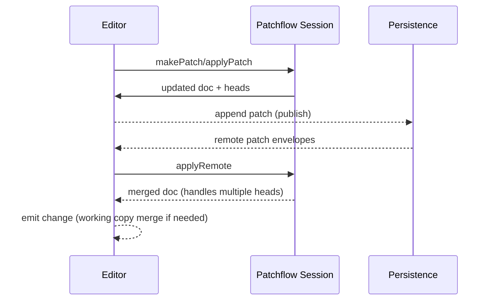

# Patchflow

Patchflow is a patch-DAG sync core factored out of the production [CoCalc](https://cocalc.com) sync engine. It is automatic revision control: every few seconds of editing becomes a commit (a patch with its parents), the history is a directed acyclic graph like Mercurial's, and concurrent branches merge deterministically on every client. Transports and storage are left to adapters.

- https://www.npmjs.com/package/patchflow
- https://github.com/sagemathinc/patchflow

## Background

Patchflow grew out of CoCalc's sync engine:

- **~2013: differential sync.** The first version of CoCalc (then SageMathCloud) used [differential synchronization](https://neil.fraser.name/writing/sync/): clients diff against a shared copy and send patches. It worked, but kept no history, and users wanted to browse and restore past versions of their files.
- **A linear sequence of patches.** The next model stored every edit as a patch, ordered by a single clock, so the document at any time was the patches up to that time applied in order. That gave full edit history ("TimeTravel"). But a version could not be relied on: a patch made at time t₁ that arrived after another user saw and saved the version at t₀ > t₁ was inserted before it, so replaying the history no longer reproduced what that user saw at t₀. That matters as soon as anything refers to a version, e.g. annotations.
- **A DAG of patches.** Each patch records its parents, the versions it was made on, as in Mercurial. A version is then defined by its ancestry, not by a position in a clock order, and a late patch from another branch cannot change it.
- **Exact values (2026).** Values are computed exactly from each patch's parents, concurrent branches merge with a deterministic three-way merge, every patch records a hash of its value, and merge commits record their result (see below). This came with property-based fuzz testing of the graph, the merge and snapshots, and with multi-client integration tests in CoCalc.

## Conceptual model

Each edit is a patch with parents: a diff from the value of its parents to the value its author saw. Patches are immutable once written. The value of a patch is computed from the value of its parents; concurrent heads are merged from the value of their common ancestors. Snapshots (the full value at a patch) let a client load only recent history.

With a codec that provides `merge3` (see below; CoCalc's codecs do), this gives:

- **Every version is reproducible.** The value a user saw when they made a patch is the value every client computes for that patch, forever: patches that arrive later, from other branches, do not change it. That is what makes history browsing, restoring old versions and annotations trustworthy.
- **Divergence is detected, not silent.** Every patch records a hash of its value (`Patch.hash`); a client that computes a different value reports it (`onInconsistency`). A snapshot that does not match its patch's hash is not used.
- **History never depends on the merge algorithm.** Merge commits record their merged value (see below), so the merge can be improved without rewriting history.
- **Undo/redo** of a client's own patches over the DAG, by reverting them three-way from the current value.
- **Merging is deferrable.** Live typing never waits for a merge; concurrent heads are merged when a value is needed.

### Exact merges for strings (`DocCodec.merge3`)

By default, concurrent patches are all applied in time order with fuzzy patch application, so a patch made against one head is applied to text that also contains the other head's changes. Fuzzy matching can then land a deletion on similar text elsewhere, or drop an insertion.

A codec that provides `merge3(base, a, b, ancestors?)` gets exact values instead: every patch is applied to the exact value of its own parents, and concurrent heads are merged three-way from the value of their common ancestors. For strings, use the exported `mergeStrings3`:

```ts
import { mergeStrings3, StringDocument } from "patchflow";

const codec = {
  // ...fromString, toString, applyPatch, applyPatchBatch, makePatch...
  merge3: (base, a, b, ancestors) =>
    new StringDocument(
      mergeStrings3({
        base: base.toString(),
        a: a.toString(),
        b: b.toString(),
        ancestors: ancestors?.map(String),
      }),
    ),
};
```

`mergeStrings3` is a line-oriented diff3 that never relocates edits by fuzzy matching, keeps whatever either side typed (a duplicate is visible and easy to fix, lost text is not), never splices characters of different words or lines together, and is symmetric in its two sides. When the history needed for an exact value is not loaded (e.g., below a snapshot), the graph falls back to the default algorithm.

### Value hashes

Every patch that `Session` commits with an exact value records `hash`, the hash of the document right after it (see [src/value-hash.ts](./src/value-hash.ts)). Clients check the values they compute against these hashes, and a snapshot carries the hash of its patch. A mismatch means this client's document differs from what its author saw; it is reported through `PatchGraphOptions.onInconsistency` (and the `Session` `inconsistency` event), and a mismatched snapshot is never used. This turns any bug in merging, snapshots or delivery into something observable instead of a silent divergence.

### Merge commits record their merged value

A patch that merges concurrent heads (a merge commit, with several parents) is a diff from the merged value of its parents, like any patch. `Session` also records that merged value as its author computed it, as a diff from one of the parents (`Patch.mergeParent`, `Patch.mergePatch`), like a Mercurial or git merge commit records its merged result. Computing the value of any patch in the history then needs no merge, so a later change to `merge3` only changes how new concurrent edits merge, never the values of patches already written; value hashes keep matching. Clients that do not know these fields read `patch` as before.

Merge commits written before this (no `mergeParent` and no `hash`) were made by versions that applied every patch in time order (patchflow 0.8 and earlier); their values are computed the same way, from the patches their parents descend from, so the values of such a history do not change either.

## How Patchflow compares

| Approach                     | Examples                                                            | What is exchanged                      | History                                 | Merging                                        |
| ---------------------------- | ------------------------------------------------------------------- | -------------------------------------- | --------------------------------------- | ---------------------------------------------- |
| Differential sync            | early CoCalc, [Neil Fraser](https://neil.fraser.name/writing/sync/) | diffs against a shadow copy            | none                                    | fuzzy patch, against the server copy           |
| Operational transformation   | Google Docs                                                         | operations, ordered by a server        | server log                              | transform concurrent operations                |
| CRDTs                        | Yjs, Automerge                                                      | operations on elements with unique ids | operation log (often garbage collected) | built into the data type                       |
| Distributed revision control | Mercurial, git                                                      | commits made by people                 | DAG of commits                          | three-way, resolved once by a person           |
| **Patchflow**                | CoCalc                                                              | diffs between whole values             | DAG of patches, snapshots               | deterministic three-way merge, on every client |

Strengths of the approach:

- **Any writer can take part.** A writer only needs to produce a new value; Patchflow diffs it. Editors, a program writing a file on disk, a Jupyter kernel writing outputs or an AI agent editing text all work the same way, without speaking an operation protocol.
- **History is the data model.** Browsing, restoring and annotating versions, and auditing who changed what, come for free, and the stored history is small: diffs plus periodic snapshots, no per-character metadata.
- **One model for text and structured documents.** Strings use diff-match-patch; JSONL tables (notebooks, chats, task lists) merge record by record and field by field.
- **Simple to embed and inspect.** You supply a `PatchStore` and optional file/presence adapters; patches are plain JSON.
- **Ideal for the common case**: one writer (a person or an agent) at a time with others watching, where Patchflow is a reliable sequence of versions with full history.

Trade-offs:

- **Intent is inferred from diffs.** OT and CRDTs see each keystroke; Patchflow sees two values and diffs them, so the merge has to recover intent (e.g. two people typing in the same word). `mergeStrings3` handles this well, but by careful heuristics rather than by construction.
- **Every client must merge identically.** Merges run independently on every replica, so they must be fully deterministic. Value hashes detect any case where they are not.
- **Many concurrent writers cost more.** Values of a wide concurrent history are computed by merging; CRDTs are cheaper when many people type in the same document at the same moment.
- **Rich text needs care.** If an editor's model is serialized to text before diffing, canonicalization by the serializer can look like an edit.

Prefer Patchflow when history matters, writers are heterogeneous (editors, files on disk, programs, agents), and most editing is one writer at a time. Prefer Yjs/Automerge for heavy simultaneous character-level editing of the same rich-text content with existing editor bindings.

## Architecture

Edits flow from editors through Patchflow, out to persistence, and back as remote patches:


```mermaid
sequenceDiagram
  participant Editor as Editor
  participant Patchflow as Patchflow Session
  participant PatchStream as Persistence

  Editor->>Patchflow: makePatch/applyPatch
  Patchflow->>Editor: updated doc + heads
  Editor-->>PatchStream: append patch (publish)
  PatchStream-->>Editor: remote patch envelopes
  Editor->>Patchflow: applyRemote
  Patchflow-->>Editor: merged doc (handles multiple heads)
  Editor-->>Editor: emit change (working copy merge if needed)
```

Patchflow does not directly handle editors, persistence or communication.

## Highlights

- Patch DAG: [src/patch-graph.ts](./src/patch-graph.ts) tracks ancestry, heads, newest common ancestors, and deterministic merges.
- Session orchestration: [src/session.ts](./src/session.ts) wraps a PatchGraph plus codecs/adapters; exposes commit, applyRemote, undo/redo pointers, history summaries, working copies, snapshots, and cursors.
- Document types:
  - Strings: [src/string-document.ts](./src/string-document.ts) with diff-match-patch.
  - SyncDB/JSONL tables: [src/db-document-immutable.ts](./src/db-document-immutable.ts) (immutable.js) and [src/db-document-immer.ts](./src/db-document-immer.ts) (immer) with indexed queries and string columns that use diff-match-patch for compact history.
- Adapters: in-memory patch store, file store, presence adapter; easy to plug your own transport.
- Examples: interactive TCP/file demo in [examples/tcp-session.ts](./examples/tcp-session.ts) and a syncdb demo in [examples/db-immer-session.ts](./examples/db-immer-session.ts).
- Tests: Vitest coverage for patch graph, session, string docs, db docs (both backends), file queueing, presence, cursors, and working copies.
- Deterministic PatchIds: each patch has an opaque id `time` of the form `<time36>_<client>`, where `time36` is a monotone millisecond timestamp (base36, fixed width) and `client` is a per-session random id (base64url). This avoids logical-time collisions even when the same `userId` commits concurrently from multiple devices/tabs; you no longer need to allocate unique user slots in a fixed 1024-user window. For a hard guarantee, pass an explicit unique `clientId` when constructing each `Session`.

## Why the DbDocument backends (immutable/immer)?

The JSONL table documents are built on immutable.js and immer to make access to the full version history of structured documents efficient and robust:

- Immutable and frozen immer document instances are safe to cache in PatchGraph and safe for working-copy rebases.
- Structural sharing keeps snapshots and undo/redo cheap without copying whole tables.
- String columns use diff-match-patch, so long text edits store compact deltas instead of full rewrites.
- JSONL/snapshot serialization is for portability; deterministic ordering is not guaranteed.

## Document authoring checklist

If you add a new Document type, aim to keep the following invariants:

- Immutable instances: Document objects must never mutate after construction (PatchGraph caches them).
- Deterministic applyPatch: same input patch yields the same output document every time.
- Reasonable makePatch: support fast patch creation for “base -> draft” edits, and define a fallback for arbitrary pairs.
- Stable equality: isEqual should be based on semantic content, not object identity.
- Snapshot format: toString/fromString should round-trip and be safe to store, even if not deterministic.

## Quickstart

```sh
npm install patchflow
```

Build/tests from source:

```sh
pnpm install
pnpm test
pnpm lint
pnpm build
```

## Try the demos

- TCP/file session (TypeScript): `node --loader ts-node/esm --experimental-specifier-resolution=node examples/tcp-session.ts --role=server --file=/tmp/patchflow-a.txt --port=8123`
- Client: same script with `--role=client --file=/tmp/patchflow-b.txt --host=127.0.0.1 --port=8123`
- SyncDB demo: `pnpm example:db-immer:server` and `pnpm example:db-immer:client`

## Status

Used in production by CoCalc for all collaborative documents (text, Jupyter notebooks, chats, task lists, whiteboards). The API is small and stable.
